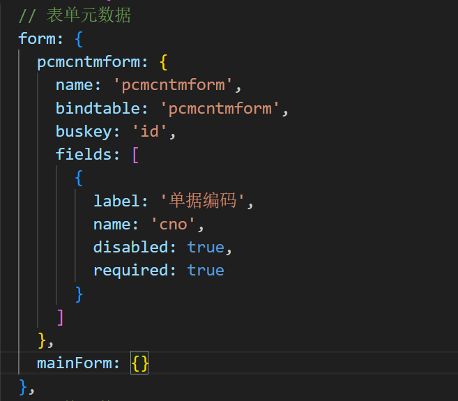

## UI元数据是什么

系统对tab页、工具条、表单、及表格组件的局部定义；ui元数据本身不包括布局信息，业务方根据自己界面布局内的功能组件选择性加载自己需要的元数据信息，来实现组件动态渲染，满足界面自定义的需求：

    
    

## UI元数据的基本用法

系统对功能性组件的封装，基本都实现了对ui元数据的集成，通过配置confKey属性来自动渲染元数据的内容；
这里confKey是一个字符串数组类型，值是组件元数据的路径，例如：['form', 'pcmcntmform'] ['grid', 'pcmcntd1grid']；

## UI元数据的高阶用法

高阶用法主要是为了满足客户个性化的需求，框架提供了一个useUIConfig hooks来获取组件的ui元数据，基于返回的元数据内容，我们可以对元数据进行重新组装来实现个性化的配置要求；同时我们也可以基于组件元数据来渲染我们自定义的组件（包括第三方组件库的组件）。

### 元数据的重新组装

基于useUIConfig返回的ui元数据信息，我们可以对ui元数据进行自己业务的封装处理来适配自己个性化的需求，同时又满足部分ui的二开需求。

### 基于元数据的渲染第三方组件

通过元数据的重新组装，我们可以基于元数据生成一份新的元数据结构来渲染第三方组件库（例如 antd、ElementUI或者自定义组件库），这样就能在满足我们个性化ui的同时支持界面二开。

